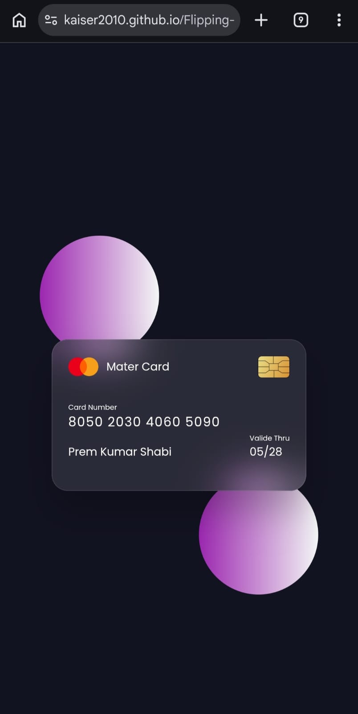
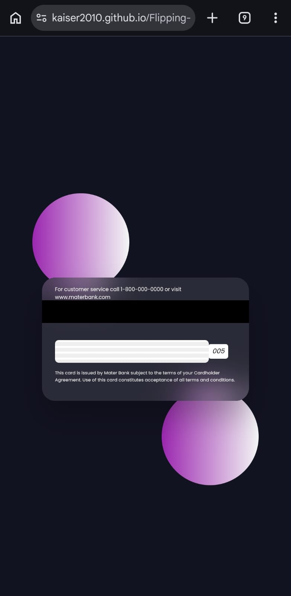

# Flipping Card UI Design

[](https://developer.mozilla.org/en-US/docs/Web/Guide/HTML/HTML5)
[](https://developer.mozilla.org/en-US/docs/Web/CSS)
[](https://developer.mozilla.org/en-US/docs/Web/JavaScript)

A sleek, glassmorphism-inspired credit card UI design featuring a smooth 3D flipping animation on hover. Built with HTML, CSS, and JavaScript, this project demonstrates advanced CSS techniques including `perspective`, `backface-visibility`, and `backdrop-filter`, as well as JavaScript for responsive behavior and interactive click-to-flip functionality.

🔗 **[Live Demo](https://kaiser2010.github.io/Flipping-Card-UI-Design/)**

## Preview

### 🖥️ Desktop View
| Front | Back |
|-------|------|
|  |  |

### 📱 Mobile View
| Front | Back |
|-------|------|
|  |  |

## Features
- **🔄 3D Flip Animation:** Interactive card that flips to reveal the back side on hover **AND** on click, making it fully mobile-friendly and accessible for touch devices.
- **✨ Glassmorphism Effect:** Modern frosted glass aesthetic achieved using `backdrop-filter: blur()` for a premium, translucent look.
- **📱 Responsive Layout:** A perfectly centered card design utilizing CSS Flexbox, with JavaScript-powered responsiveness to ensure a seamless experience across all screen sizes.
- **💳 Detailed Design:** Meticulously crafted with essential credit card elements like a chip, branding logo, magnetic strip, and a realistic signature area.
- **🔡 Custom Typography:** Elegant typography integrated with Google Fonts (Poppins) for a clean, professional finish.

## Getting Started
To get a local copy of this project up and running, follow these steps:

1. **Clone the repository:**
   ```bash
   git clone https://github.com/kaiser2010/Flipping-Card-UI-Design.git
   ```
2. **Open the project:**
   Simply open `index.html` in any modern web browser.
3. **Visit the Live Demo:**
   Check out the live version at [https://kaiser2010.github.io/Flipping-Card-UI-Design/](https://kaiser2010.github.io/Flipping-Card-UI-Design/)

## Project Structure
```text
Flipping Card UI Design/
├── index.html      # Main HTML structure
├── style.css       # Custom CSS styling and animations
├── script.js       # Handles responsiveness and onclick card flip interaction
└── images/         # Project assets
    ├── chip.png    # Credit card chip image
    └── logo.png    # Master Card / Branding logo
```

## How It Works
- **CSS:** Handles the core 3D flip visuals using `perspective`, `backface-visibility`, and CSS transitions for smooth motion.
- **JavaScript:** Adds an `onclick` toggle to trigger the flip animation for mobile/touch users and manages dynamic layout adjustments to maintain responsiveness.

## Contributing
Contributions are welcome! If you have any ideas or improvements, feel free to fork the repository and open a pull request.

1. Fork the Project
2. Create your Feature Branch (`git checkout -b feature/AmazingFeature`)
3. Commit your Changes (`git commit -m 'Add some AmazingFeature'`)
4. Push to the Branch (`git push origin feature/AmazingFeature`)
5. Open a Pull Request

## License
This project is licensed under the MIT License.

## Author
**Omar Hassoun**
- Email: omarahassouna@gmail.com
